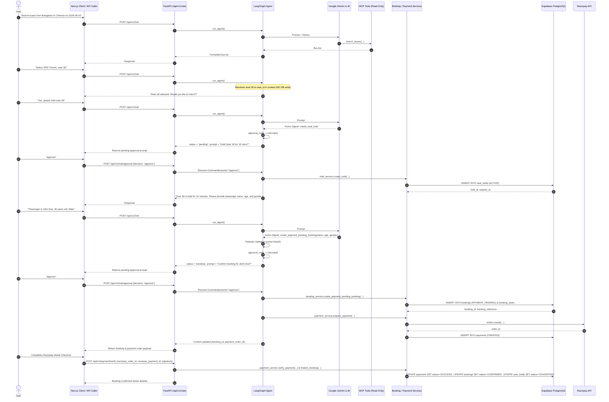
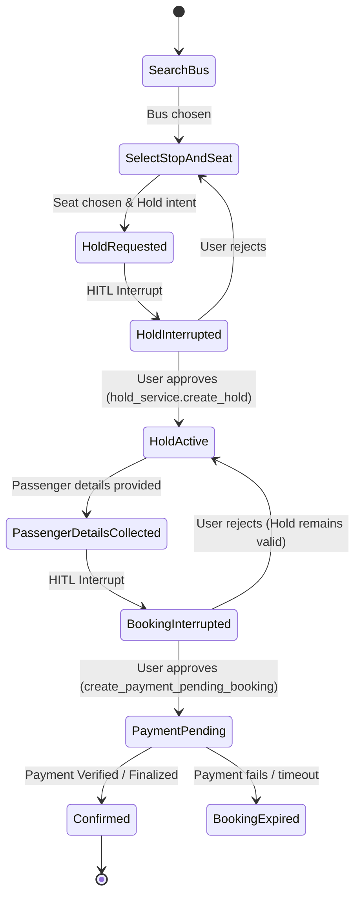

# End-to-End Bus Booking Workflow Walkthrough

This document provides a complete technical and operational walkthrough of the **Agentic AI Bus Ticket Booking Application**, detailing the workflow from search to seat hold, passenger information collection, Human-in-the-Loop (HITL) approval, payment-pending booking creation, Razorpay order generation, and final booking confirmation.

---

## 1. Architectural Principles

The system is designed with strict boundaries separating conversational reasoning, tool execution, safety barriers, and database transactions:

1. **Read-Only MCP Tools:**
   - Database exploration tools (`search_buses`, `get_bus_details`, `check_seat_availability`) are strictly read-only.
   - MCP tools never perform database mutations or execute SQL queries on behalf of the LLM.
2. **Deterministic Action Interception:**
   - Gemini cannot write to the database or call mutation services directly.
   - Sensitive mutations are declared as **action signals** (`create_seat_hold`, `create_payment_pending_booking`), which are intercepted by the LangGraph application layer before any external side effects occur.
3. **No Direct UUID Exposure:**
   - The user and LLM interact using conversational values (seat numbers like `"1B"`, stop names like `"Bangalore"`).
   - Application logic maps human-readable inputs to authoritative database UUIDs loaded into `BookingContext`.
4. **Authoritative PostgreSQL Source of Truth:**
   - Relational constraints, seat availability checks, overlapping segment validation, and concurrency locks are enforced directly in PostgreSQL.
5. **Human-in-the-Loop (HITL) Boundaries:**
   - Both **Seat Hold** and **Payment Booking Creation** require explicit user approval via LangGraph interrupts (`interrupt()`), ensuring no action occurs without user consent.

---

## 2. End-to-End Workflow Sequence



---

## 3. Component Details & Code Structure

### 3.1. Passenger Data Validation & Action Building
**File:** `src/bus_booking_ai_agent/phase_03_mcp/tools/create_booking.py`

- **`CreateBookingArguments` Model:**
  - `passenger_name`: String, non-empty, stripped of leading/trailing whitespace.
  - `passenger_age`: Integer, strictly between 1 and 120.
  - `passenger_gender`: Case-insensitive string normalized via `@field_validator` to uppercase `"MALE" | "FEMALE" | "OTHER"` to satisfy PostgreSQL `CHECK ((passenger_gender = ANY (ARRAY['MALE'::text, 'FEMALE'::text, 'OTHER'::text])))`.
  - `model_config = ConfigDict(extra="forbid")`: Prevents Gemini from injecting or manipulating IDs, prices, or internal fields.
- **`build_pending_booking_action()` Function:**
  - Verifies presence of an active `hold_id` in `BookingContext`.
  - Extracts authoritative journey parameters (`schedule_id`, `seat_id`, `boarding_stop_id`, `dropping_stop_id`, `seat_number`, operator, route).
  - Returns a clean dictionary with `action: "create_payment_pending_booking"` and all verified parameters.

### 3.2. LangGraph Agent Orchestration
**File:** `src/bus_booking_ai_agent/phase_04_langgraph/test_integrated_agent.py`

- **State Model:**
  `BookingContext` manages state transitions across turns:
  ```python
  class BookingContext(TypedDict, total=False):
      # Journey & Seat Selection
      schedule_id: str
      seat_id: str
      seat_number: str
      boarding_stop_id: str
      dropping_stop_id: str
      # Seat Hold
      hold_id: str
      hold_expires_at: str
      # Passenger Info
      passenger_name: str
      passenger_age: int
      passenger_gender: str
      # Booking & Payment
      booking_id: str
      booking_reference: str
      booking_status: str
      total_amount: float
      payment_id: str
      payment_order_id: str
      payment_order_amount: int
  ```
- **Action Signal Interception (`llm_node`):**
  - Identifies when Gemini emits `tool_name == "create_payment_pending_booking"`.
  - Validates parameters with `validate_booking_arguments(tool_arguments)`.
  - Stashes `pending_action` in `AgentState` and sets `approval_status = "pending"`.
- **HITL Approval Barrier (`approval_node`):**
  - Formats an explicit approval prompt containing complete travel, passenger, seat, and price details.
  - Calls `interrupt()` to suspend graph execution until explicit user decision is received.
- **Transactional Execution (`booking_execution_node`):**
  - Invoked upon `approve` decision.
  - Calls `booking_service.create_payment_pending_booking()` to create PostgreSQL rows in `bookings` and `booking_seats`.
  - Calls `payment_service.prepare_payment()` to create a Razorpay payment order and save a row in `payments`.
  - Updates `BookingContext` with authoritative booking and payment details.
- **Routing & Replay Idempotency:**
  - `route_after_approval` routes `"create_seat_hold"` to `hold_execution` and `"create_payment_pending_booking"` to `booking_execution`.
  - Replaying an approval on an already executed action immediately returns the existing booking details without recreating rows.

### 3.3. API Layer
**File:** `main.py`

- **`POST /api/v1/chat` & `POST /api/v1/chat/approval`:**
  - Carries conversation session in secure HttpOnly cookie `bus_booking_conversation_id`.
  - Enforces user isolation (`thread_id = f"{user.id}:{conversation_id}"`).
  - Serializes both human-readable text and structured `booking` / `payment_order` payloads for the frontend.
- **`POST /api/v1/payment/verify`:**
  - Verifies Razorpay HMAC signature (`razorpay_order_id|razorpay_payment_id`).
  - Upon valid signature, updates payment status to `SUCCESS` and atomically executes `finalize_booking()` to convert hold to `CONVERTED` and set booking to `CONFIRMED`.
- **`POST /api/v1/payment/finalize`:**
  - Directly confirms the booking and marks the hold as converted once payment has been marked successful.

---

## 4. State Transitions



### Entity Status Lifecycles

| Entity | Initial State | Post-Approval State | Final Confirmed State | Failure / Rejection State |
| :--- | :--- | :--- | :--- | :--- |
| **`seat_holds`** | `ACTIVE` | `ACTIVE` | `CONVERTED` | `RELEASED` / `EXPIRED` |
| **`bookings`** | *(none)* | `PAYMENT_PENDING` | `CONFIRMED` | `CANCELLED` / `EXPIRED` |
| **`payments`** | *(none)* | `CREATED` | `SUCCESS` | `FAILED` |

---

## 5. Verification & Testing

The implementation is verified by two test suites:

### 1. Booking Workflow Tests (`tests/test_booking_workflow.py`)
- **`test_validate_booking_arguments`**: Confirms strict Pydantic parsing, forbidding extra fields and validating age/gender boundaries.
- **`test_booking_without_hold_fails`**: Verifies that booking attempts fail if an active hold does not exist.
- **`test_booking_approval_creates_real_booking_and_payment_order`**: Verifies full creation of `PAYMENT_PENDING` booking, `booking_seats` row, and Razorpay order in the database.
- **`test_booking_rejection_cancels_action_keeps_hold`**: Verifies rejection clears the pending action while leaving the active seat hold intact.
- **`test_booking_idempotent_approval_replay`**: Verifies that repeated approval requests return existing booking without duplicate inserts.
- **`test_booking_fails_if_hold_expired`**: Simulates expired seat hold and verifies graceful advisory rejection.
- **`test_fastapi_endpoints_for_booking`**: Verifies FastAPI HTTP response models for approval and payload schemas.
- **`test_payment_verify_and_finalize_endpoint`**: Verifies transactional status transition to `CONFIRMED` booking and `CONVERTED` seat hold.

### 2. Seat Hold Workflow Tests (`tests/test_seat_hold_workflow.py`)
- 14 regression tests covering bus search, seat selection without holds, stop requirements, HITL interrupts, database holds, idempotent replay, and thread isolation.

### Running the Test Suites

To run all 22 tests against the PostgreSQL database:

```powershell
.\.venv\Scripts\python.exe -m pytest tests/ -v
```

Output:
```
tests/test_booking_workflow.py ........                                  [ 36%]
tests/test_seat_hold_workflow.py ..............                          [100%]
============================== 22 passed in 125.52s ==============================
```

